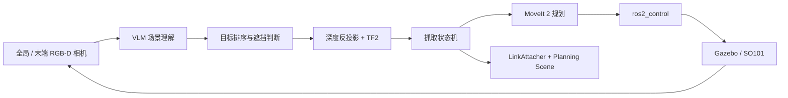

# VLM-ARM

> 基于视觉语言模型与 ROS 2 的 SO101 草莓采摘机械臂仿真系统

[](https://docs.ros.org/en/humble/)
[](https://releases.ubuntu.com/22.04/)
[](https://moveit.picknik.ai/humble/)
[](LICENSE)

VLM-ARM 是一个面向农业采摘场景的具身智能仿真项目。系统使用
**Qwen3-VL-Plus** 理解 RGB-D 图像、选择抓取目标并判断遮挡关系，通过深度图和
TF2 将二维视觉锚点转换为三维位姿，最后交给 **MoveIt 2**、**ros2_control**
和 **Gazebo Classic** 完成规划、抓取、搬运与放置。

机械臂模型基于开源 [SO-ARM100 / SO101](https://github.com/TheRobotStudio/SO-ARM100)，
当前仓库主要面向 **Ubuntu 22.04 + ROS 2 Humble** 仿真环境。

## 功能特性

- SO101 URDF/Xacro、网格模型和手眼深度相机
- Gazebo Classic 草莓种植床、泥土地面、草莓植株和测试方块场景
- MoveIt 2 运动规划、Cartesian 接近轨迹与 ros2_control 轨迹执行
- 基于 Qwen3-VL-Plus 的多目标检测、成熟度判断与目标排序
- 全局相机粗定位 + 末端相机精定位的两阶段视觉管线
- 软遮挡物推扫、抓取失败重试、目标黑名单和循环采摘
- Gazebo LinkAttacher 与 MoveIt Planning Scene 双层附着管理
- 面向普通物体测试的单阶段简化管线

## 系统架构



完整管线首先使用全局 Gemini 335 相机寻找并排序目标，再移动机械臂到观察位姿，
通过末端相机完成精定位。抓取状态机根据目标元数据选择直接接近或先推扫软遮挡物，
随后完成闭合夹爪、抬升、搬运、放置，并继续处理下一目标。

## 仓库结构

```text
.
├── src/
│   ├── lerobot_description/    # SO101 URDF/Xacro、网格、Gazebo 与 RViz 配置
│   ├── lerobot_controller/     # ros2_control 控制器配置
│   ├── lerobot_moveit/         # MoveIt 2 配置、SRDF 与启动文件
│   ├── position_topic/         # VLM、相机、抓取状态机、场景和测试
│   ├── docs/                   # 设计、计划与汇报材料
│   └── PROJECT_OVERVIEW.md     # 更详细的项目说明
├── LICENSE
└── readme.md
```

| ROS 2 包 | 作用 |
| --- | --- |
| `lerobot_description` | 提供机器人描述、手眼相机、Gazebo 场景和 RViz 可视化 |
| `lerobot_controller` | 配置机械臂与夹爪的 Joint Trajectory Controller |
| `lerobot_moveit` | 提供运动学、关节限制、规划组和控制器桥接配置 |
| `position_topic` | 实现 VLM 推理、三维定位、抓取状态机与 Planning Scene 管理 |

## 环境要求

- Ubuntu 22.04（原生或 WSL2）
- ROS 2 Humble
- Gazebo Classic 11
- MoveIt 2
- Python 3
- 可访问 DashScope API 的网络环境和 API Key
- [IFRA LinkAttacher](https://github.com/IFRA-Cranfield/IFRA_LinkAttacher)

> [!IMPORTANT]
> 本仓库没有包含 `linkattacher_msgs` 和 `ros2_linkattacher`。构建前必须将
> IFRA LinkAttacher 克隆到同一工作空间的 `src/` 下。

## 安装

### 1. 安装 ROS 2 依赖

先按照 [ROS 2 Humble 官方文档](https://docs.ros.org/en/humble/Installation/Ubuntu-Install-Debs.html)
安装 ROS 2，然后安装项目所需组件：

```bash
sudo apt update
sudo apt install -y \
  python3-colcon-common-extensions \
  python3-numpy \
  python3-opencv \
  python3-pip \
  python3-rosdep \
  ros-humble-cv-bridge \
  ros-humble-gazebo-ros-pkgs \
  ros-humble-gazebo-ros2-control \
  ros-humble-moveit \
  ros-humble-ros2-control \
  ros-humble-ros2-controllers \
  ros-humble-tf2-geometry-msgs
```

安装 VLM 客户端：

```bash
python3 -m pip install --user "openai>=1.0"
```

### 2. 准备工作空间

将本仓库克隆为 ROS 2 工作空间根目录：

```bash
git clone <repository-url> ~/lerobot_ws
cd ~/lerobot_ws/src
git clone --branch humble https://github.com/IFRA-Cranfield/IFRA_LinkAttacher.git
```

如果当前目录已经是本仓库根目录，只需在 `src/` 下补充 LinkAttacher。

### 3. 安装其余依赖并构建

```bash
cd ~/lerobot_ws
source /opt/ros/humble/setup.bash

# 首次使用 rosdep 时执行；若已经初始化可跳过前两行
sudo rosdep init
rosdep update

rosdep install --from-paths src --ignore-src -r -y
colcon build --symlink-install
source install/setup.bash
```

建议将工作空间环境加入 shell 配置：

```bash
echo "source ~/lerobot_ws/install/setup.bash" >> ~/.bashrc
```

## 配置 VLM

项目通过 DashScope 的 OpenAI 兼容接口调用 `qwen3-vl-plus`。启动前设置：

```bash
export DASHSCOPE_API_KEY="your-api-key"
```

请勿将真实 API Key 写入代码、README 或提交到 Git。

## 快速开始

### 完整草莓采摘管线

启动 Gazebo、控制器、MoveIt、RViz、VLM 桥接节点和抓取状态机：

```bash
source /opt/ros/humble/setup.bash
source ~/lerobot_ws/install/setup.bash
ros2 launch position_topic move_demo.launch.py
```

等待 Gazebo、相机话题和控制器完成初始化后，在新终端发送任务：

```bash
ros2 topic pub --once /task_command std_msgs/msg/String \
  "{data: '找出并采摘所有成熟且可以安全抓取的草莓'}"
```

查看执行状态：

```bash
ros2 topic echo /grab_status
ros2 topic echo /task_status
```

当系统连续两轮没有发现可用目标时，`/task_status` 将发布
`task_complete`。

### 方块测试场景

运行完整的两阶段视觉管线，但不加载草莓植株：

```bash
ros2 launch position_topic test_no_strawberry.launch.py
```

运行仅使用全局相机的单阶段简化管线：

```bash
ros2 launch position_topic test_no_strawberry_simple.launch.py
```

简化管线默认启用通用物体 Prompt，适合先验证 VLM、深度反投影和基本抓取链路。

### 仅查看机器人模型

```bash
ros2 launch lerobot_description so101_display.launch.py
```

### VLM Dry Run

仅执行视觉推理，不发布抓取目标：

```bash
ros2 run position_topic vlm_bridge --ros-args -p dry_run:=true
```

## 核心话题

| Topic | 类型 | 说明 |
| --- | --- | --- |
| `/task_command` | `std_msgs/msg/String` | 输入自然语言任务 |
| `/target_pre_grasp` | `geometry_msgs/msg/PoseStamped` | 全局相机生成的粗定位目标 |
| `/target_observation_pose` | `geometry_msgs/msg/PoseStamped` | 末端相机观察位姿 |
| `/target_pose` | `geometry_msgs/msg/PoseStamped` | 末端相机生成的精定位目标 |
| `/target_metadata` | `std_msgs/msg/String` | 目标成熟度、材质、遮挡与接近方向等 JSON 元数据 |
| `/grab_status` | `std_msgs/msg/String` | 抓取状态及阶段反馈 |
| `/task_status` | `std_msgs/msg/String` | 整体任务状态 |

主要服务和动作接口：

- `/move_action`：MoveIt `MoveGroup`
- `/compute_cartesian_path`：Cartesian 路径规划
- `/arm_controller/follow_joint_trajectory`：机械臂轨迹执行
- `/gripper_controller/follow_joint_trajectory`：夹爪轨迹执行
- `/ATTACHLINK`、`/DETACHLINK`：Gazebo 物体附着与分离

## 抓取流程

```text
IDLE
  → SETUP
  → MOVE_TO_OBSERVE
  → AWAIT_STAGE2
  → PRE_GRASP
  → [PUSH_SWEEP]
  → APPROACH
  → GRASP
  → LIFT_PLAN
  → TRANSPORT_PLAN
  → PLACE
  → IDLE
```

其中 `PUSH_SWEEP` 仅在目标上方存在遮挡且该遮挡被判断为软材质时触发；
推扫失败会降级为直接接近，不会终止整轮任务。

## 测试

构建完成后运行 `position_topic` 的单元测试和代码检查：

```bash
cd ~/lerobot_ws
source install/setup.bash
colcon test --packages-select position_topic
colcon test-result --verbose
```

当前测试覆盖多目标排序规则、推扫触发条件和推扫航点生成。

## 已知限制

- 当前项目以 Gazebo 仿真为主，尚未提供经过验证的 SO101 实机驱动流程。
- LinkAttacher 是独立外部依赖，缺失时 `position_topic` 无法构建或执行抓取。
- VLM 推理依赖 DashScope 网络服务，延迟、配额和模型输出可能影响任务稳定性。
- MoveIt Planning Scene 尚未完整建模所有草莓场景物体的碰撞关系。
- 部分目标可能超出 SO101 的有效工作空间，需要调整机械臂或植株位置。

更完整的模块说明、参数和设计记录见
[`src/PROJECT_OVERVIEW.md`](src/PROJECT_OVERVIEW.md) 与
[`src/docs/`](src/docs/)。

## License

本项目采用 [Apache License 2.0](LICENSE)。


